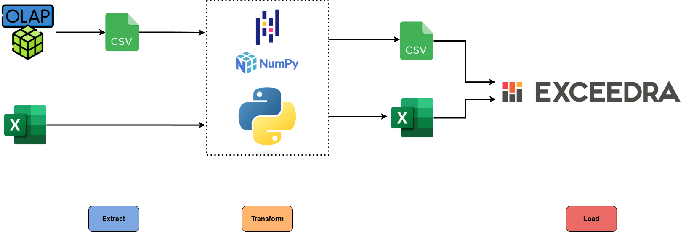

# Overview
A set of scripts written in Python for automation of CP-CS (Cycle Plan-Customer Specific) data processing.

Using Pandas and NumPy, the scripts ingest xlsx/b and csv files, process these files for merchandise activity forms, and outputs a file/s that's ready for use on the AFS / MARS retail execution platform.

# Introduction
This is a personal project built while self-studying Python during my previous job as a data analyst at a multinational FMCG company. Around 70% of my time during this tenure was spent manually cleaning, validating, and processing large datasets for the company's merchandise operations, and so I figured I'd try building a program that addresses this issue.

Because this was built during my time as a beginner with Python and programming in general, the code is quite messy--no modularity, overly long comments, no concept of the DRY principle, and just an overall lack of adherence to best practices. Documentation was also poorly written. I only knew that, after several months of testing on actual data, it worked as intended and was eventually deployed for the position's future use after my resignation.

The program shortens what is usually 2-3 days worth of manual work, requiring use of multiple tools (i.e Excel, Power BI, DAX, and/or Kutools), to just a few clicks. Depending on the volume of data, a script usually parses through data and outputs a file in less than a minute. 

For being my first ever project implemented at a work environment, despite how poorly written the codebase may have been, it still alleviates ~60-70% of the weekly workload for the position, and for that I am incredibly proud of it.

# Architecture

## Pre-requisites

## Dependencies

# Usage

Directory structure is perhaps the most critical aspect in running a script. Setup your folder tree

It's important to note that using these scripts assumes thorough familiarity with CP-CS procedures.

# Planned Changes

- place dicts and lists in a separate `references.py` file
- create `functions.py` for tasks that are common across all scripts:
    - reading in excel and csv files
    - parsing dates
    - chain and category adjustments
    - creating fields for groupings, form names, and form IDs
    - creating and processing separate dataframe for Customer Code/Group Name csv (Per Door scripts)
    - writing DFs to excel
        - consider different `functions.py` that contain specific functions for Per Region-Channel, Per Chain, and Per Door operations
- fuzzy string matching to replace convoluted list comprehensions that standardize chain and category names
- transfer all comments regarding CP-CS operations and instructions here on the readme file